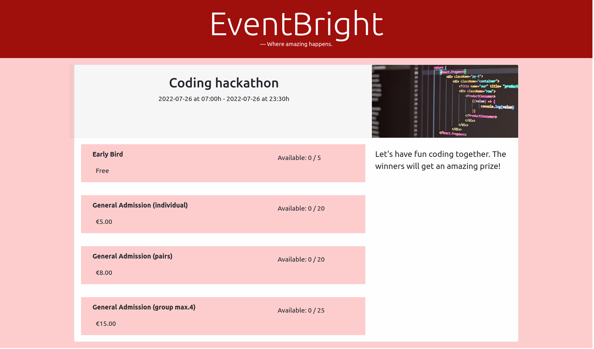

# EventBrite Technical Assignment

This repo is the result of working on EventBrite's technical assignment as a test to apply for an internship.

# Installation

1. First of all, run `yarn install` to dowload all dependencies
2. Create a new `.env.local` file in the main directory and add the following code to add your EventBrite API Token:
   1. `REACT_APP_EB_TOKEN=your_token`
3. Run `yarn start` to run the page on port 3000

# Screenshots

# Constraints
There is no backend to this project due to time constraints. I was also very confused about what you meant by how you wanted to save all the information. I apologize. 